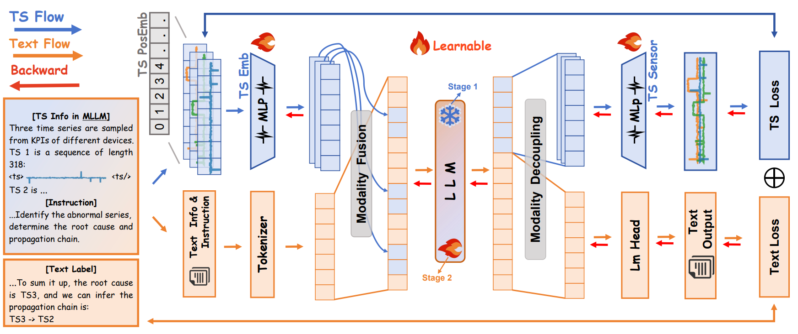

# TimeSense
TimeSense is a Qwen2.5-based framework for time-series reasoning. It introduces a disentangled reconstruction objective that supplies explicit temporal supervision alongside language supervision. The repository contains three coupled research components:

- **TimeSense**: a time-series encoder and reconstruction decoder for explicit temporal supervision.
- **ChronGen**: a change-aware, rules-oriented generator for time-series instruction data.
- **EvalTS**: a diagnostic benchmark spanning Atomic, Molecular, and Compositional temporal reasoning.




## Installation

EvalTS scoring and ChronGen generation use the dependencies in `requirements.txt`.

```bash
pip install -r requirements.txt
```

Training additionally requires the ChatTS-Training stack and DeepSpeed:

```bash
pip install -r requirements-train.txt
```

Run all commands from the repository root. The shell scripts in `scripts/` are thin convenience wrappers; the Python modules are the portable interfaces for Windows, macOS, and Linux.

## EvalTS

EvalTS contains 15 task types. Atomic tasks cover univariate and multivariate change points, extrema, spikes, trends, and periodicity. Molecular tasks cover segmentation, comparison, and relative trends. Compositional tasks cover rule-based anomaly detection and root-cause analysis.

Generate the tracked demo split or the full split (300 examples per task):

```bash
python -m chron_gen.generate eval
python -m chron_gen.generate eval --full
```

Data are stored by task under `data/eval/demo/` and `data/eval/full/`. The full split is generated locally and ignored by Git.

EvalTS requests a natural-language answer, extracts a task-specific structured prediction, then computes accuracy or F1. Change-point and segmentation boundaries use the legacy `±5` tolerance; spike and comparison coordinates use `±3`; periodicity uses the legacy `±5` tolerance.

### Evaluate a local checkpoint

Use a unified model profile. `input_mode: auto` uses a native time-series processor when the checkpoint provides one; standard Hugging Face causal LMs use serialized time-series values.

```bash
python -m evalts.evaluate --full \
  --model-config model_config.yaml \
  --results results/eval
```

For an unmodified text-only Qwen checkpoint, the existing CLI remains available:

```bash
python -m evalts.evaluate --full \
  --model /path/to/Qwen2.5-7B-Instruct \
  --text-only \
  --results results/eval
```

### Evaluate an OpenAI-compatible endpoint

EvalTS supports any standard OpenAI-compatible endpoint, including a locally served vLLM model. Configure `evaluation_model` in `model_config.yaml` with `backend: openai_compatible`, then keep its key in an environment variable:

```bash
export LLM_API_KEY=your-api-key
python -m evalts.evaluate --full --model-config model_config.yaml --results results/eval
```

The answer extractor is configured separately in `llm_config.yaml`. It uses the same standard protocol and never receives the reference answer. Results are written by task beneath `results/<experiment>/shard/`.

### Evaluate an external runner

To evaluate a model whose runtime is not a dependency of this repository, export label-free inputs. Every row has a stable `id`; the external runner must write exactly `{"id": "...", "output": "..."}` for each input, preserving that ID. Point `model_config.yaml` to the resulting JSONL with `backend: external_jsonl`, then run the usual evaluator. A custom Python runner can instead set `backend: package.module:factory`; its factory receives `ModelSpec` and returns an object implementing `generate(samples) -> list[Generation]`.

```bash
python -m evalts.export_inputs --data data/eval/full --output /path/to/evalts_inputs
python -m evalts.evaluate --full --model-config model_config.yaml --results results/eval
```

## ChronGen

ChronGen produces rule-labelled examples with four fields: `input`, `output`, `timeseries`, and `type`. Its optional formatter follows the training-corpus construction practice used by ChatTS: it improves the natural-language expression while preserving the rule-derived answer, values, indices, and time-series placeholders.

```bash
# Rule-labelled generation without a formatter.
python -m chron_gen.generate train --full

# Generation with the OpenAI-compatible formatter configured in llm_config.yaml.
export LLM_API_KEY=your-api-key
python -m chron_gen.generate train --full --format
```

The full training split is written to `data/train/chron_gen_train.jsonl` and is ignored by Git. `data/train/demo.jsonl` is retained as a lightweight format example.

## TimeSense training

Training uses the released ChatTS-Training codebase without modifying it. Before training, obtain the ChatTS-Training codebase and the `Qwen2.5-14B-Instruct` weights; neither is distributed with this repository. The stage-1 input checkpoint (`models/ChatTS-14B-train`) must be prepared from these external resources following the ChatTS-Training instructions.

The training framework is compatible with Qwen2.5-based ChatTS checkpoints and supports further training from them. This initialization is intended to improve performance over training from the base model alone.

Create ignored local links to the external checkout and model directory:

```bash
ln -s /path/to/ChatTS-Training chatts_training
ln -s /path/to/models models
pip install -r chatts_training/requirements.txt
```

Stage 1 freezes the LLM and optimizes only the time-series reconstruction MSE. Stage 2 unfreezes the LLM and jointly optimizes language modelling and reconstruction. The released configurations use 8 GPUs by default.

```bash
python -m chron_gen.generate train --full --format
bash scripts/train_stage1.sh
bash scripts/train_stage2.sh
```

Each stage copies its source checkpoint into `tmp/`, applies the TimeSense append files in that isolated copy, and trains through ChatTS-Training. The final exported inference checkpoint omits the reconstruction decoder, so it does not add decoder computation at generation time.

## Repository layout

```text
chron_gen/  ChronGen rules and generation entry points
evalts/     EvalTS dataset, task specifications, model backends, parsing, and metrics
timesense/  TimeSense model append files and training orchestration
configs/    Stage 1 and Stage 2 training configurations
scripts/    Thin workflow wrappers
data/       Demo data and locally generated full splits
results/    Demo results and ignored local experiments
```

## Data and weights

Full datasets, checkpoints, external ChatTS-Training links.

## Acknowledgments

TimeSense's time-series model architecture extends [ChatTS](https://github.com/NetManAIOps/ChatTS). Its training implementation builds upon [ChatTS-Training](https://github.com/xiezhe-24/ChatTS-Training), which is based on [LLaMA-Factory](https://github.com/hiyouga/LlamaFactory). We thank their authors and contributors for making their code publicly available.

## License

This project is licensed under the MIT License (see LICENSE).

## Cite

Citation metadata will be added after the EMNLP'26 review process is complete.